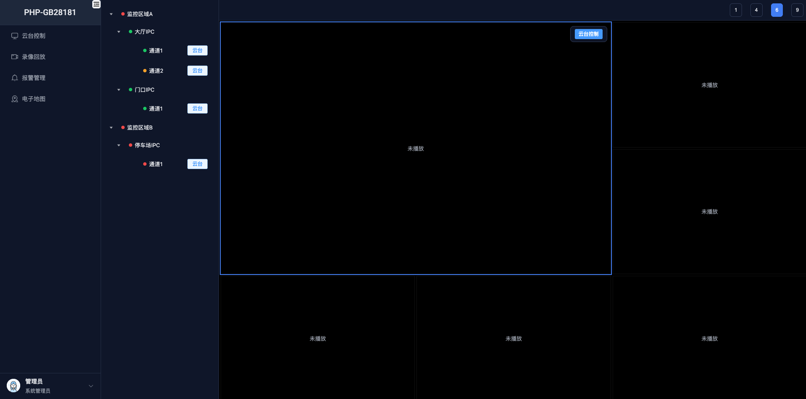
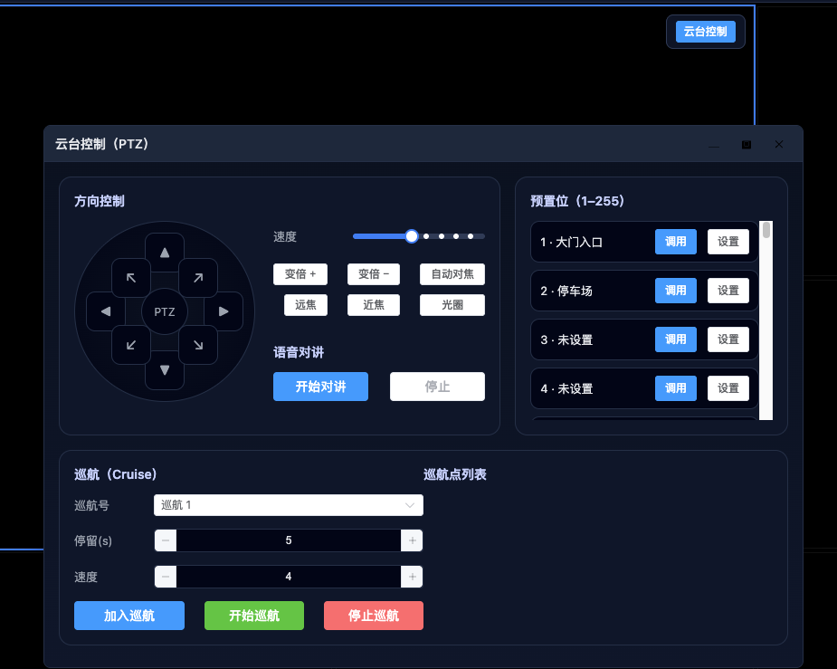
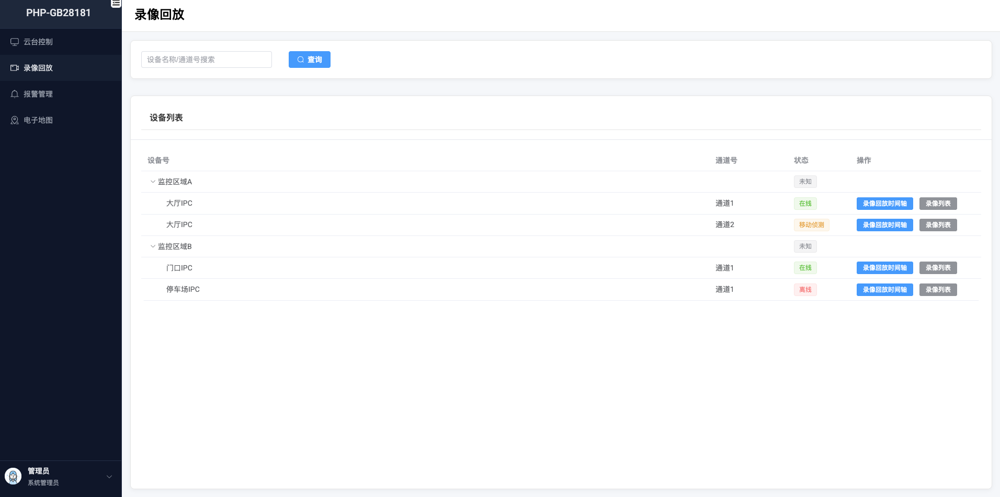
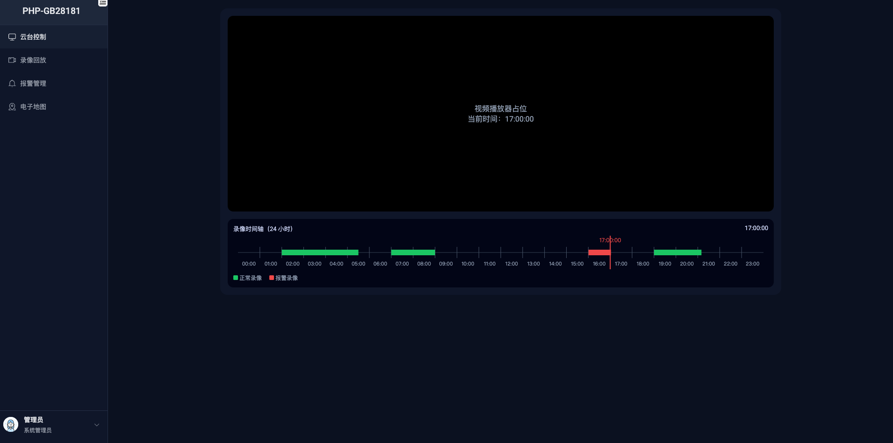
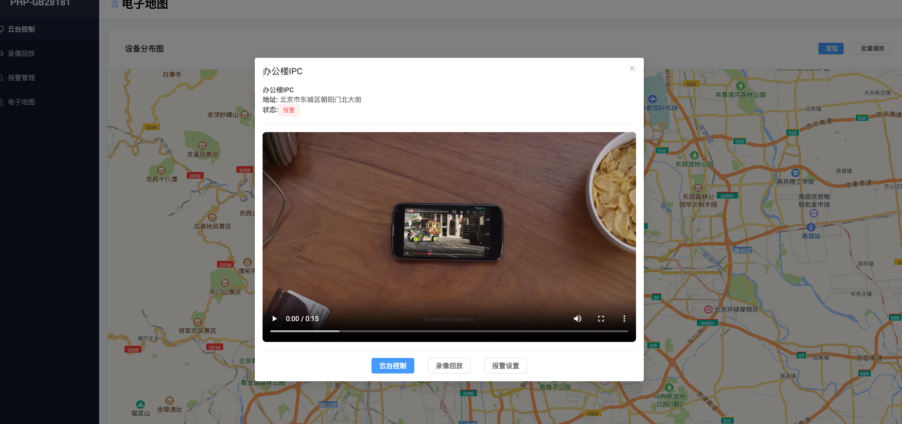

# Vue3+TS+Vite 安防 UI 模板及演示

针对PHP ExoSip 扩展实现的GB28181网关，开发的一套基于 Vue3、TypeScript 和 Vite 的安防 UI 模板，包含一整套监控系统组件，并提供实时演示。该项目可作为构建集成视频管理功能的安防应用程序的模板。

## 核心功能

- **云台控制**：设备树及通道列表，多屏回放（1、4、6、9 屏布局），集成云台控制面板，支持方向控制、缩放、预置位管理和语音对讲

- **视频回放**：基于时间从 NVR/IPC 检索录像，可视化时间轴，支持录像下载

- **报警管理**：报警列表显示，状态处理（激活、确认、清除），分页和筛选

- **电子地图**：集成 AMap（高德地图），显示设备位置，点击播放视频模态窗口

## 技术栈

- Vue 3（组件 API）

- TypeScript

- Vite（构建工具）

- Vue Router

- Pinia（状态管理）

- Element Plus（UI 组件库）

- Axios（HTTP 客户端）

- Mock.js（数据模拟）

- Vue3-Amap（地图集成）

## 项目结构

``` src/

├── api/ # API 接口

├── assets/ # 静态资源

├── components/ # 共享组件

│ ├── layout/ # 布局组件

│ └── ptz/ # 云台控制组件

├── mock/ # 模拟数据

├── router/ # 路由配置

├── stores/ # Pinia 状态管理

├​​── styles/ # 全局 SCSS 变量和 mixin

├── utils/ # 实用函数

└── views/ # 页面组件

├── alarms/ # 报警管理页面

├── map/ # 电子地图页面

├── ptz/ # 云台控制页面

└── video/ # 视频播放页面

```

## 设置和安装

```bash

# 安装依赖项

pnpm install

# 环境配置
cp .env.example .env

```
VITE_APP_TITLE=PHP-GB28181
VITE_AMAP_KEY=xxxx , 获取高德地图密钥
```
# 启动开发服务器

pnpm dev

# 构建生产版本

pnpm build
```
# 演示地址
http://localhost:3230
默认用户名密码：admin/123456
## 开发指南

- 所有 API请求封装在 `src/utils/request.ts` 文件中。

- 模拟数据定义在 `src/mock/index.ts` 文件中。

- 路由配置位于 `src/router/index.ts` 文件中。

- 页面组件按功能模块组织在 `src/views` 目录中。

- 全局样式和主题变量位于 `src/styles/` 目录中。


## API 模拟

该项目使用 Mock.js 来模拟后端 API，包括：

- 设备树和通道信息

- 云台控制命令

- 预设管理

- 录像检索和下载

- 报警管理

- 地图设备数据

## 主要特性

- 现代化的用户界面，采用一致的安防主题

- 完全响应式设计

- 可使用 SCSS 变量自定义主题

- 全面的视频管理界面

- 直观的云台控制，带有视觉反馈

- 集成地图可视化

- 基于角色的用户界面元素

## 效果
<table>
  <tr>
    <td></td>
    <td></td>
    <td></td>
    <td></td>
  </tr>
  <tr>
    <td></td>
    <td></td>
    <td></td>
    <td></td> <!-- 空单元格保持表格整齐 -->
  </tr>
</table>

## 许可证

MIT

## 感谢
- QwenCode
- ChatGpt
